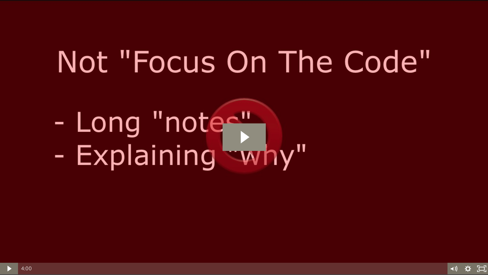

## What's an egghead lesson?

A great lesson requires two things:

* a desire to share knowledge
* the patience to learn the process

**We aren't looking for new/novel/exciting ways to present and teach**. 

*egghead.io style* is to record your screen and walk a collegue through a concept or feature. We don't use fancy video editing tricks or transitions beyond simply cutting out empty space, mistakes, and excessive "ummm"s and making sure the audio gain is at a consistent level.


You can think about an egghead lesson like calling a coworker over to your desk to show them something cool that you just learned. Would you make a slide deck for them? Would you use star-dissolve transitions? Probably not!

We aren't looking for that either. We want to see concise efficient knowledge transfer that respects **your** time, and the time of the student as well. Nothing fancy. We don't want fancy, we want badass. That's you. Teach us what you know.

This video will show you the differences between egghead and non-egghead style screencasts:

### Three Pillars of egghead

#### Respect the audience

Developers are busy people. We bet that you are a busy person, with lots going on personally and professionally. We have limited time to learn and teach, and often we learn because of an impending deadline. We don't have time to waste, and when a developer is watching an egghead video, they expect it to be concise, on target, and useful for their current situation.

We want to deliver a well titled lesson that contains what the viewer will expect without a lot of surprise. A lesson called "creating routes in Express" shouldn't diverge and discuss a whiz-bang D3.js pie chart that also happens to be in the example.

Have you ever been to a conference or user group talk, and left slightly confused when the talk was over and wasn't what you were expecting? Was the title misleading? Maybe it was "link bait"? We don't want to surprise people that way. Your title and description for lessons will inform the viewer what to expect. Stick to that!

We also don't need to spend time with formalities like greetings or personal introductions. It seems like a good idea, but most users are watching several videos. Do you say "hello my name is Kim" every 3 minutes when talking to a co-worker? 😳

Probably not. We can drop the "hello" and the "good bye" entirely. It's not rude, we promise.

Be sure to **show your work**. Show what you are doing. Use the mouse to guide the viewers eye around the screen as you explain the topic of the lesson. Make sure the **code** you are discussing is front and center. People code along to these, so consider that and make it easier for them to follow along.

#### You're the hero!

You're smart and know a lot of stuff. Did you always know all of the things? Nope. Can you remember any "aha!" moments in your own journey? Any particular author, blogger, or screen caster that has helped you? What was good about their content, and how can you pass that gift of knowledge along?

**Capture the "AHA!" moment** by showing the moment leading up to and directly after that point in time.

Another example is when a tough Google search lands you on a Stack Overflow question that matches the problem you are having right now. That well-constructed answer that is thorough, thoughtful, and comprehensive. The author of the answer is a **hero** in that moment.

You can **be that hero** to somebody else with your thorough, honest answer!

#### Do the Work

The number one key to success in teaching people to code better via screencasts is simply **hitting the f'n record button** and explaining the thing. It can be uncomfortable at first. It can even feel a lot like stage fright, but the sooner you start recording, the sooner we will be pushing the "publish" button on your first egghead course.

Your first lesson will probably stink. It's a fact, and it is totally fine. Send it to your mentor for feedback, and they will get you on track.

Your time is **valuable** too. Don't waste it trying to figure everything out on your own. You've got your mentor, the egghead team, and dozens of fellow instructors willing and able to help you achieve success.

We are here to help, and happy to do it!

