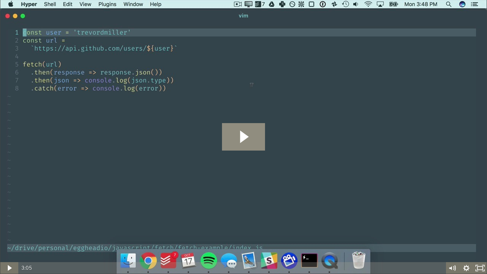
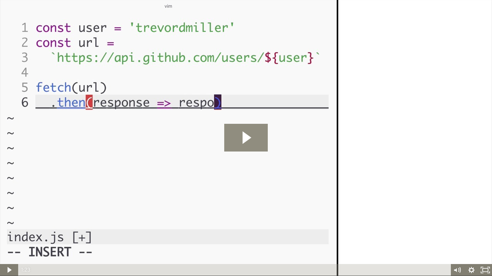

## Recording High-Quality Coding Screencasts

This video will show you how to prepare your screen for recording:

This is the nuts and bolts of what we do at egghead.io. We sit down, prepare our screens, and record complicated technical concepts to share with other developers around the world.

Screencasting is not easy. It's freaking hard, actually. It is a learned skill that takes consistent practice over time.

To top it off, we are very picky about our screencasts that we publish on egghead.io!

We want screencasts that are top notch, and provide a baseline level of quality to the user. We want them to share a sameness in terms of quality and presentation.

This doesn't mean we want you to not be you. On the contrary, we want your style to flourish and be ever present in your egghead.io lessons.

This is about mechanics! The technical aspects of presentation and accessibility. Our goal is to present lessons that are clear and provide the maximum clarity and visibility. Video by nature is a restrictive format. We have to consider a wide range of people that will want to view this content.

If we maximize the legibility of the code we are presenting, it will help all learners to absorb the information to the best of their abilities.

Small fonts, blurry text, and low-contrast color schemes all distract and distract the user from the primary object: learning.

### The Code

⚡️ **The code is the champion of an egghead.io screencast**.

To that end, it deserves **maximum** horizontal space. It is a good idea to use an 80 or 120 character "column" for the code and bump the font size up to fit.

We will typically work in a 3 column layout, with the editor taking up 2/3s and a browser on the right side in the remaining 1/3 of the screen. You might prefer to flip back and forth between the browser and the editor, it is up to you.

It is important to keep in mind that some padding allowances should be considered for the top and bottom of the recording window, as they can get cut off by player chrome. For instance, if you're recording the terminal, commands towards the bottom might not be visible, and this can be frustrating/distracting.

#### Plunker for web examples when possible
Your development environment, text editor, and output for recording are up to you. When possible we want to use Plunker to embed code alongside the lessons. Each lesson will have the completed code solution presented in the video!

For `console` output examples, [here is a Plunk](https://embed.plnkr.co/github/bclinkinbeard/egghead-d3v4/03-time-scales?show=src%2Fapp.js,preview) that demonstrates how to do that simply with JS by overriding `console.log`

#### Github for more complex examples
Sometimes we can't embed the code in a working fashion. This is true for examples that are part of larger applications that leverage webpack or something similar, or for examples that aren't web based at all. In these cases we prefer Github.

Github examples should **include a README** that explains how to run them and use appropriate `npm` scripts for idiomatic usage.

#### Fallback!

If it just wont work in Plunker we also support JSBin and CodePen. We also allow you to just paste in some markdown.

### Resolution

* 1280x720 (720p)
* 16:9 Aspect Ratio
* Stereo audio

We deliver content at 720p (1280x720 in pixels). We want this to be a crisp and legible output for the user. We want egghead.io lessons to present well when expanded fullscreen on a 65" TV screen or watched on the bus on a phone.

⚡️ **For best results, we use HiDPI mode on our monitors.**

HiDPI mode is also known as Retina Display on macs or DPI scaling more broadly. This allows us to view very high resolutions with readable text, by effectively doubling each pixel.

_image from [designmodo.com](http://designmodo.com/wp-content/uploads/2013/01/retinaComparison.png)_

#### DPI Scaling on Windows

_we need to research Windows better!_

[This article](http://www.eizoglobal.com/support/compatibility/dpi_scaling_settings_windows/) discusses pixel scaling on Windows. We've also had success just boosting the code fonts up to really max out the screen. Aspect ratio is key here, so set your screen to the highest 16x9 resolution and kick the fonts up.

Using DPI scaling features is nice because you can scale the OS chrome and make UI more legible.

#### HiDPI Mode on macOS

On Mac, we've gotten the best results when we record at **1280x720(HiDPI)** mode, giving an effective visible resolution of 1280x720, but **extremely** crisp. This resolution is achievable on 27" monitors and retina MBPs.

It's "hidden" by default, and the easiest way to achieve this resolution on a mac is with a software tool that exposes the option.

To enable HiDPI, we use the [RDM tool](https://github.com/avibrazil/RDM). On retina MacBooks, this "just works". For external monitors, or non-retina Macs, you can follow [these instructions to enable HiDPI mode](http://cocoamanifest.net/articles/2013/01/turn-on-hidpi-retina-mode-on-an-ordinary-mac.html).

Using HiDPI mode gives an extremely crisp final product that looks fantastic (readable) on phones and tablets.

Another application that works well is [SwitchRezX](http://www.madrau.com/srx_download/download.html). It's shareware and requires a fee if it is useful.

If you can't use this mode, recording at normal 1280x720 or 2560x1440 are a decent substitute. By constraining to this small window, you are able to fill the screen effectively for coding screencasts. The **most import thing to get correct** is the aspect ratio. We don't want to present with any black bars around the screen. We want to give the user maximum code visibility at all times.

### Screen Layout

It's important to give the person learning easy access to what we are trying to teach. Since we are using video, we want the text to be as clear and legible as possible. People will watch these lessons on large monitors, as well as small portable screens.

This is the preferred structure, where we are presenting the code on the left covering 2\/3rds of the screen and the example on the right covering the other third. This will look something like:

Notice that the code's font size has been increased to **maximize the space** available.

The **example will be on the right**, and occupies 1\/3rd of the screen. This is something to consider when you are creating examples, as they will have to fit into that space. The example should be simple, and it is often best to use a minimally responsive layout for the example.

In some cases, the example is replaced by a terminal, or a terminal window shares the right column with the example. In this latter case, the terminal window would be on the bottom right hand section of the screen.

The most important thing to consider is **why the user is watching the lesson**. Generally, it is so they can learn about some tool or feature. They _need_ to **see the code**!

⚡️ **The code needs to be comfortable.**

Now that the screen is ready to record, we will look at how to do that on your platform.

### Capture and Editing

For video capture, on a Mac we can use ScreenFlow, Camtasia, or IShowU HD. On Windows, we stick to Camtasia. There are other tools available for those platforms, but we generally stick to these as they cover most use cases.

#### Recording Video

This video will show you how you can record in "chunks":

[ScreenFlow](https://www.telestream.net/screenflow/) and Camtasia both provide editing features. We tend to prefer ScreenFlow, and egghead.io instructors are all provided any software licenses you might need.

The decision on which software you use is up to you. Many instructors prefer the standalone simplicity of ScreenFlow.

* [Trevor D. Miller showing how he uses ScreenFlow in his process.](https://www.youtube.com/watch?list=PL219naRJXQKbQJ60WxsuGfTFv7_fvna51&v=9R2nl2wtB_4)
* [Joe Maddalone takes a look at editing in Screenflow](https://www.youtube.com/watch?v=3nlJ_wP9dPE&index=5&list=PL219naRJXQKbQJ60WxsuGfTFv7_fvna51)

You can "kick it up a notch BAM!💥" and move into more sophisticated editing technology with software like Adobe Premiere. Premiere provides some significant advantages, but it also has a steep learning curve. We would recommend starting simple, and leveling-up to a non-linear editing system like Premiere later.

* [John Lindquist doing some diting in Premiere](https://www.youtube.com/watch?v=_YqhKP-yZzo&index=1&list=PL219naRJXQKbQJ60WxsuGfTFv7_fvna51)
* [JS Leonard walks through his process using Premiere](https://www.youtube.com/watch?v=faINApx4-4g&list=PL219naRJXQKbQJ60WxsuGfTFv7_fvna51&index=2)
* [Joel Hooks does voice over and editing in Premiere](https://www.youtube.com/watch?v=faINApx4-4g&list=PL219naRJXQKbQJ60WxsuGfTFv7_fvna51&index=2)

#### Capturing Audio Separately

There are effectively three ways that you can record your screencasts.

* Audio First, Video Second
* Video First, Audio Second
* All at once

:zap: **all of these approaches are valid.**

There are instructors that prefer each of these approaches. All at once is arguably the simplest approach, as you can just type and record the screen and don't have to think about the video and audio separately.

When you record the audio first, you can playback the audio and record video to match. On the flip side, with video recorded first you can narrate over video playback.

It can be challenging to sync and get a natural feeling with narration. Like most things, it takes practice.

#### Editing

This video will show you how you can can edit with ripple delete:

Editing is a skill. It takes time to become proficient, and it can be tedious until then.

:zap: **ripple delete is your greatest ally!**

Here's the first YouTube tutorial Google kicks back on [ripple delete](https://www.youtube.com/watch?v=Fks7ABBnb0I).

If there is one tool you will use forever when editing video it's ripple delete.

To take full advantage of ripple delete the recommendation we give people is to **record in small sections**. Don't try to be Snoop Dogg. _You are not the 1-take dizzle my shizzle_.

Record in "paragraphs" and pause.

This recording in small pieces and pausing is effectively editing while you record.

:zap: **record high quality content bites to avoid editing hassles**

You want to avoid a situation where you are doing intense editing to move audio and video snippets around to build a quilt like final product. **This** is the most tedious thing you could do to yourself, so by recording in small paragraph bites, you can get better takes, and by pausing in between each section, you can see visibly where you need to **ripple delete** and build your final product with minimal aggravation!

You do want to go back and make sure you edit out mouth noises and excessive "um"s. If you find yourself having to edit these out, it might take some pre-thought to avoid including them in the first place.

:zap: **the easiest way to edit is to capture it well**

This video shows the result of an egghead style lesson after editing:

